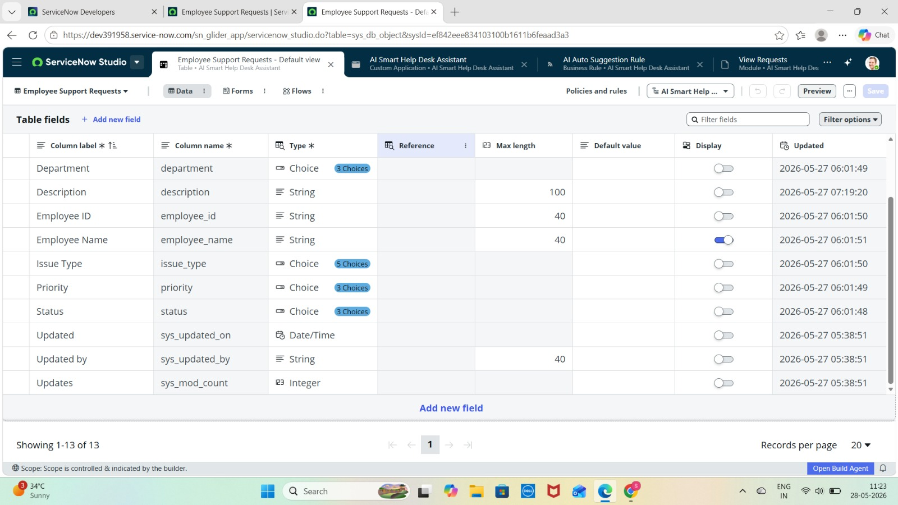
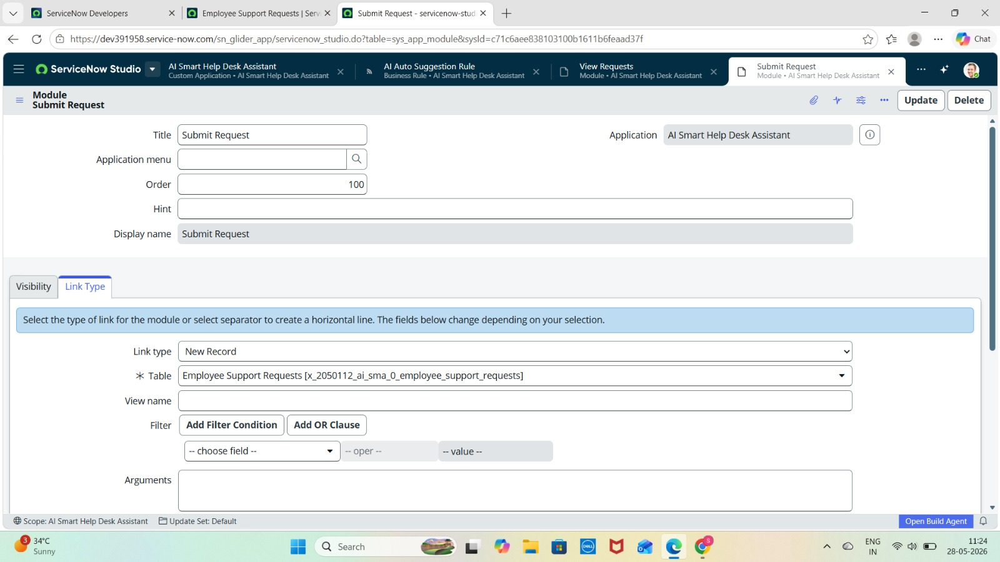
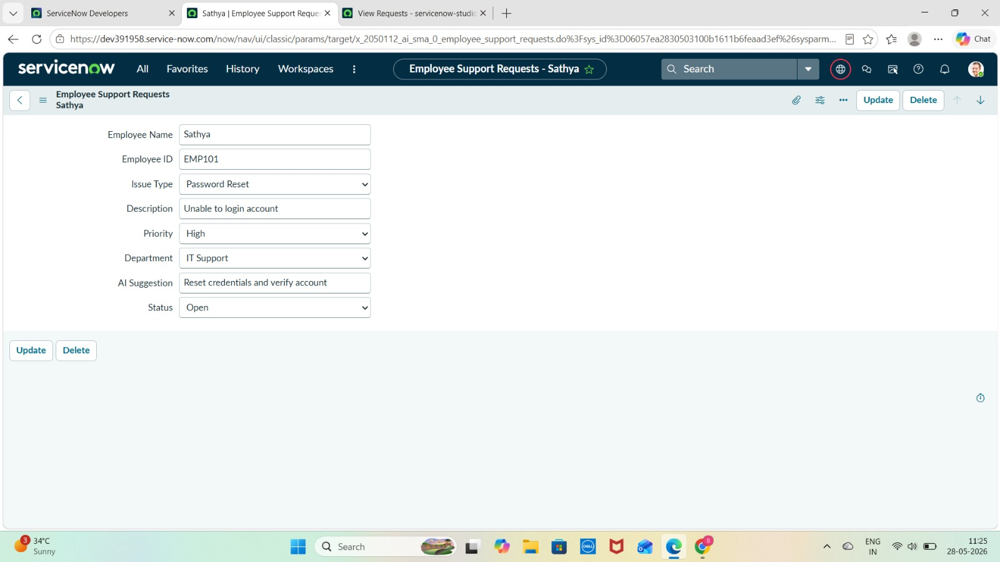
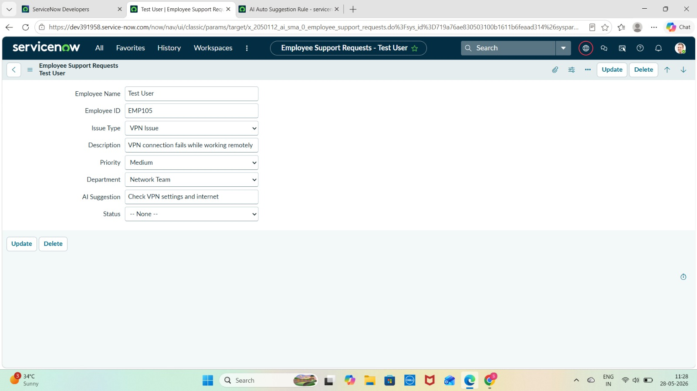
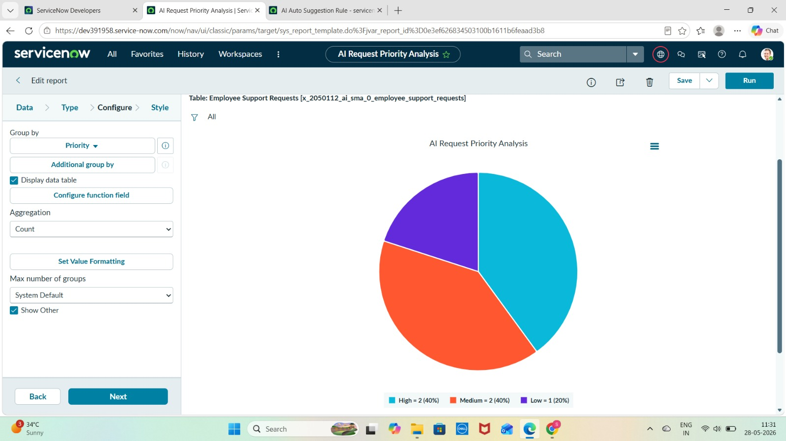
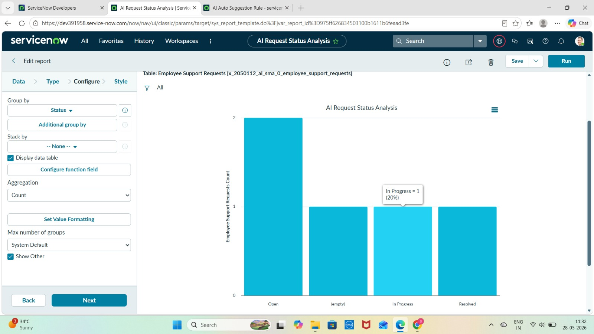
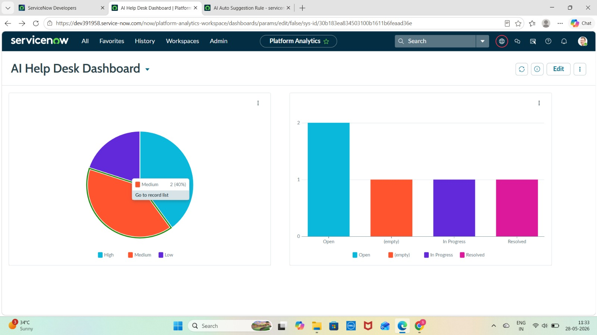

# 🤖 AI Smart Employee Help Desk Assistant using ServiceNow

---

# 📌 Project Overview

The AI Smart Employee Help Desk Assistant is a ServiceNow application developed to automate employee support request management within an organization. The application helps employees submit IT-related support requests such as password reset issues, VPN connectivity problems, email access issues, and software access requests.

The project uses ServiceNow Business Rules to simulate AI-based automation by automatically predicting request priority, assigning the appropriate department, and generating smart suggestions based on the issue type selected by the employee.

This application reduces manual effort in handling support tickets and improves the efficiency of request management through automation and dashboard analytics.

---

# 🎯 Why This Project Was Developed

In many organizations, employee support requests are handled manually, which can lead to delays, incorrect routing, and inefficient issue management.

This project was developed to:

✅ Automate employee request handling

✅ Reduce manual work for support teams

✅ Improve issue categorization

✅ Automatically assign departments

✅ Predict request priority

✅ Provide smart support suggestions

✅ Monitor requests using dashboards and reports

The project demonstrates how ServiceNow automation features can improve operational efficiency in IT support environments.

---

# 🛠️ Technologies Used

* ServiceNow Platform
* ServiceNow Studio
* Tables & Forms
* Business Rules
* Reports
* Dashboards
* Role-Based Access Control (RBAC)

---

# 📂 Application Details

## 🔹 Application Name

AI Smart Help Desk Assistant

## 🔹 Application Scope

Scoped Application

---

# 👥 Roles Created

## 🔸 x_2050112_ai_sma_0.admin

Used for administrative access and managing application configurations.

## 🔸 x_2050112_ai_sma_0.user

Used for employees to submit and view support requests.

---

# 📑 Modules Created

## 🔹 Submit Request

Used to create new employee support requests.

## 🔹 View Requests

Used to view all submitted requests.

---

# 🗂️ Table Created

## 🔹 Employee Support Requests

**Table Name:**
`x_2050112_ai_sma_0_employee_support_requests`

The table stores employee support request details and automation results.

---

# 🧾 Fields Created

| Field Name    | Type   | Purpose                         |
| ------------- | ------ | ------------------------------- |
| Employee Name | String | Stores employee name            |
| Employee ID   | String | Stores employee ID              |
| Issue Type    | Choice | Stores request category         |
| Description   | String | Stores issue description        |
| Priority      | Choice | Stores request priority         |
| Department    | Choice | Stores assigned department      |
| AI Suggestion | String | Stores automated recommendation |
| Status        | Choice | Stores request status           |

---

# ⚙️ Choice Values Configured

## 🔹 Issue Type

* Password Reset
* VPN Issue
* Email Problem
* Software Access

## 🔹 Priority

* Low
* Medium
* High

## 🔹 Status

* Open
* In Progress
* Resolved

## 🔹 Department

* IT Support
* Network Team
* Security Team

---

# 🧪 Sample Records Created

| Employee Name | Employee ID | Issue Type      | Priority | Department    | Status      |
| ------------- | ----------- | --------------- | -------- | ------------- | ----------- |
| Sathya        | EMP101      | Password Reset  | High     | IT Support    | Open        |
| Priya         | EMP102      | VPN Issue       | Medium   | Network Team  | Open        |
| Rahul         | EMP103      | Email Problem   | High     | IT Support    | In Progress |
| Poojitha      | EMP104      | Software Access | Low      | Security Team | Resolved    |

---

# 🤖 AI Automation Using Business Rule

## 🔹 Business Rule Name

AI Auto Suggestion Rule

## 🔹 Purpose of the Business Rule

The Business Rule automatically:

✅ Predicts request priority

✅ Assigns departments

✅ Generates AI-like smart suggestions

based on the selected issue type.

This automation simulates AI-based support handling in ServiceNow.

---

# 🧠 Business Rule Logic

## 🔸 Password Reset

* Priority → High
* Department → IT Support
* AI Suggestion → Reset credentials and verify account

## 🔸 VPN Issue

* Priority → Medium
* Department → Network Team
* AI Suggestion → Check VPN settings and internet

## 🔸 Email Problem

* Priority → High
* Department → IT Support
* AI Suggestion → Verify mailbox and credentials

## 🔸 Software Access

* Priority → Low
* Department → Security Team
* AI Suggestion → Verify approval and permissions

---

# 💻 Business Rule Script

```javascript
(function executeRule(current, previous) {

if(current.issue_type=="password_reset"){
current.priority="high";
current.department="it_support";
current.ai_suggestion="Reset credentials and verify account";
}

else if(current.issue_type=="vpn_issue"){
current.priority="medium";
current.department="network_team";
current.ai_suggestion="Check VPN settings and internet";
}

else if(current.issue_type=="email_problem"){
current.priority="high";
current.department="it_support";
current.ai_suggestion="Verify mailbox and credentials";
}

else if(current.issue_type=="software_access"){
current.priority="low";
current.department="security_team";
current.ai_suggestion="Verify approval and permissions";
}

})(current, previous);
```

---

# 📊 Reports Created

## 🔹 AI Request Priority Analysis

* Report Type: Pie Chart
* Purpose: Displays request distribution based on priority levels.

## 🔹 AI Request Status Analysis

* Report Type: Bar Chart
* Purpose: Displays request counts based on request status.

---

# 📈 Dashboard Created

## 🔹 Dashboard Name

AI Help Desk Dashboard

## 🔹 Dashboard Purpose

The dashboard provides visual analytics for monitoring employee support requests and analyzing request priorities and statuses.

## 🔹 Dashboard Components

✅ AI Request Priority Analysis (Pie Chart)

✅ AI Request Status Analysis (Bar Chart)

---

# 🔄 Project Workflow

1️⃣ Employee submits a support request.

2️⃣ Employee selects the issue type.

3️⃣ Business Rule executes automatically.

4️⃣ Priority is predicted automatically.

5️⃣ Department is assigned automatically.

6️⃣ AI suggestion is generated automatically.

7️⃣ Request is stored in the table.

8️⃣ Reports and dashboards visualize request analytics.

---

# ⭐ Key Features

✅ Employee request submission system

✅ AI-inspired automation

✅ Automatic priority prediction

✅ Smart department assignment

✅ Automated suggestions generation

✅ Dashboard analytics

✅ Interactive reports

✅ Role-based access control

---

# 🚀 Advantages of the Project

✅ Reduces manual support handling

✅ Improves ticket management efficiency

✅ Enhances issue categorization

✅ Improves support response process

✅ Provides centralized request tracking

✅ Demonstrates ServiceNow automation skills

---

# 📚 Learning Outcomes

✅ Scoped Application Development

✅ Table Creation

✅ Form Configuration

✅ Role-Based Access Control

✅ Business Rule Scripting

✅ Report Creation

✅ Dashboard Development

✅ ServiceNow Automation

---

# 🔮 Future Enhancements

✅ Virtual Agent chatbot integration

✅ Email notification system

✅ SLA tracking

✅ Approval workflows

✅ Machine learning recommendations

✅ Self-service employee portal

---

# 🏁 Conclusion

The AI Powered Employee Help Desk Assistant successfully demonstrates how ServiceNow can be used to automate employee support request management using Business Rules, reports, and dashboards.

The project improves operational efficiency by automatically predicting priorities, assigning departments, and generating support suggestions based on issue categories.

This project showcases practical ServiceNow development skills including application development, automation, scripting, reporting, and dashboard creation.

---

# 📸 Screenshots

## 🖼️ 1. Table Structure

This screenshot displays the Employee Support Requests table structure created in ServiceNow.



---

## 🖼️ 2. Modules

This screenshot shows the modules created inside the AI Smart Help Desk Assistant application.

### 🔹 Submit Request Module



### 🔹 View Requests Module


---

## 🖼️ 3. Request Form

This screenshot displays the employee support request form used for submitting support tickets.



---

## 🖼️ 4. Business Rule Script

This screenshot displays the AI Auto Suggestion Business Rule script used for automation.


---

## 🖼️ 5. Auto-filled AI Record

This screenshot demonstrates automatic AI-based field population using Business Rules.



---

## 🖼️ 6. Priority Pie Chart

This screenshot displays the AI Request Priority Analysis Pie Chart report.



---

## 🖼️ 7. Status Bar Chart

This screenshot displays the AI Request Status Analysis Bar Chart report.



---

## 🖼️ 8. Dashboard

This screenshot displays the AI Help Desk Dashboard used for request analytics monitoring.


